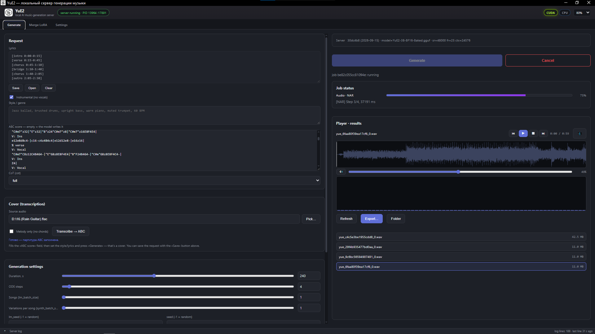

# 🚀 YuE2UI: Frontier music generation app

   
  

## 🔧 About
**YuE2UI** is a frontier music generation app for generating music and songs locally on your Windows PC.

**YuE2UI** presents own baked BF16/Q8 models that support generating not only songs, but instrumental compositions (opposite to official YuE2 models).

## ⚙️ Installation
YuE2UI uses C++ pre-build server as backend with Rust/Tauri Front-end UI.

YuE2UI server supports GTX16xx/RTX20xx-50xx GPU cards and generation on CPU.

### 🖥️ Windows Usage

➤ Please Note:
    - I'm supporting only nVidia GTX16xx and RTX20xx-50xx GPUs.
    - This app is intended for those running Windows 10 or higher. 
    - Application functionality for systems running Windows 7 or lower is not guaranteed.

- Download the YuE2UI.exe app for Windows in [Releases](https://github.com/LeeAeron/YuE2UI/releases).
- Place the YuE2UI.exe file in any folder in the root of any partition with a short Latin name without spaces or special characters and run it.
- Run app. Go to the Settings tab and tap "Install server" button.
- Afer ap download and placed server files, choose model to install and install model you want into 'models' folder.
- After finishing installation model, server must automatically run on.
- Generate music!

## ⚙️ Features:
- support to safetensors/GGUF/LoRa models
- fully portable separate UI-app (needed WebView engine only)
- auto-saving settings into own json config for using on any other PC (with YuE2UI app)
- generation prompts presets with saving into own json config for using on any other PC (with YuE2UI app)
- ful control under music generation via UI
- app scale option
- output audio format settings (wav16 by default/mp3 or 320kbps by default)
- integrated audioplayer with wave view and frequency analyzer
- option to rename/delete/view properties generated file
- option to generate instrumental only
- option to view system load (CUDA/CPU) with glowing logos in the header, and more info by tapping by them
- feature to merge LoRas with base models with option to quantize final model
- two UI languages (auto/russian/english)
- option to choose models (base/vae/transcriber) directly from UI
- fluid output file naming control
- autosaving generated files into /outputs folder
- advanced Log feature
- server/models folder autodeection after moving server to another directory/folder/disk
- FFMPEG-based audio conversation with advanced quality andd format settings
- cover mode for cover music
- ABC-score generation and view for generated tracks and for tracks to cover
- 6GB VRAM + 16Gb RAM minimal requirements to generate with BF16 model (highest quality)

## 📺 Credits

* [LeeAeron](https://github.com/LeeAeron) - main code, reworking, enhancements, LoRa implementation, UI/UX
* [ServeurpersoCom](https://github.com/ServeurpersoCom) - YuE2 C++ server sources

## 📝 License

The **YuEUI** is released under Apache License. 
